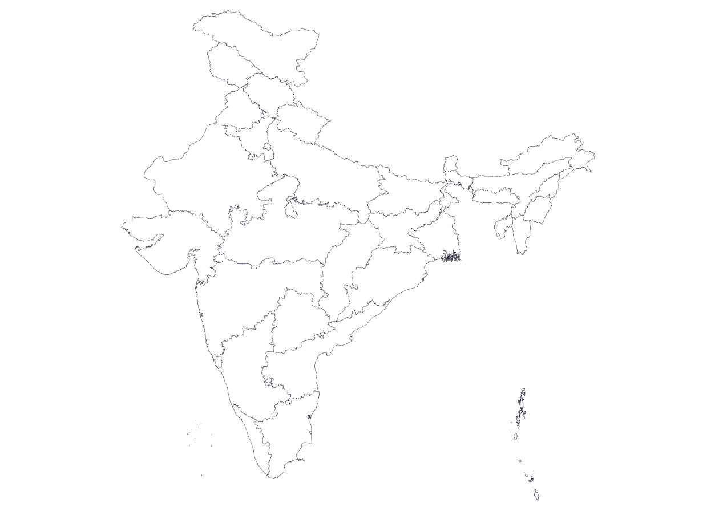

# India State Boundary GeoJSON

This repository contains open source GeoJSON data representing the state boundaries of India. The data is organized on a state-by-state basis, making it easy to incorporate into your geographic information systems (GIS) or other mapping applications. Whether you're building a web application, conducting research, or simply exploring India's geographical features, this dataset provides valuable information.

## Contributing

If you find any issues with the data or want to contribute improvements, please open a GitHub issue or submit a pull request. Your contributions are welcome!

## License

This India State Boundary GeoJSON data is provided under the [Open Database License (ODbL)](./LICENSE), which allows you to use, share, and modify the data freely. Please review the license terms for specific details.

## Acknowledgments

This data is made available thanks to various government agencies and open data initiatives. We acknowledge and appreciate their efforts in providing valuable geographic data for public use.